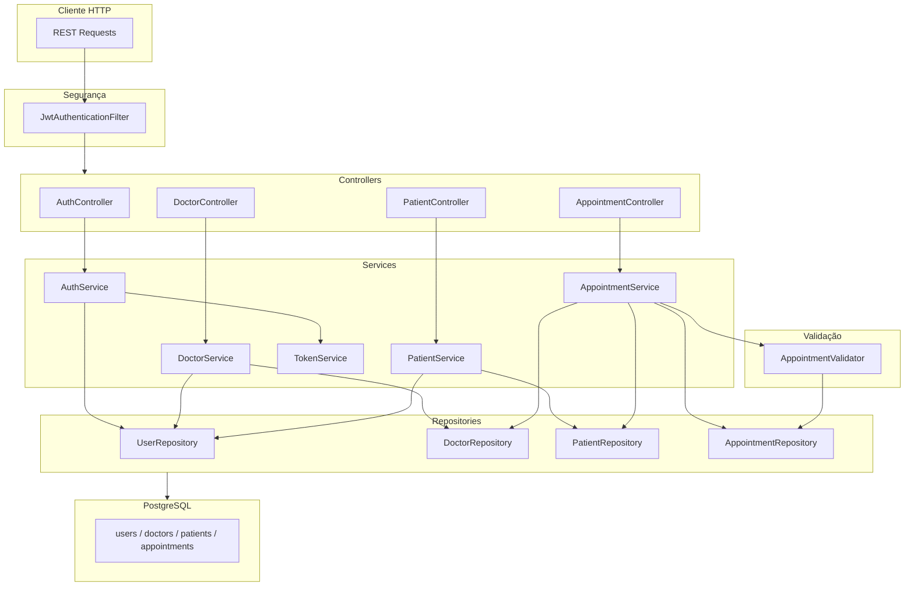
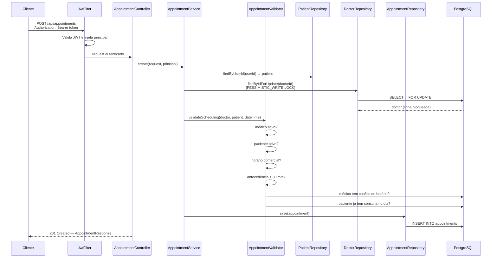
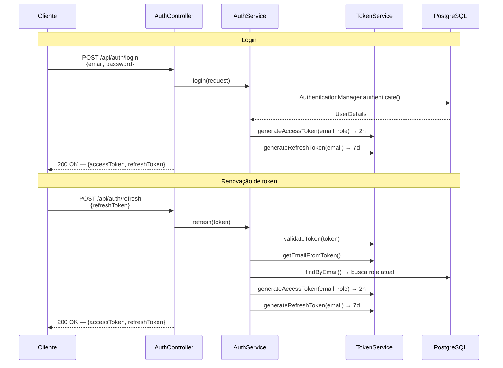
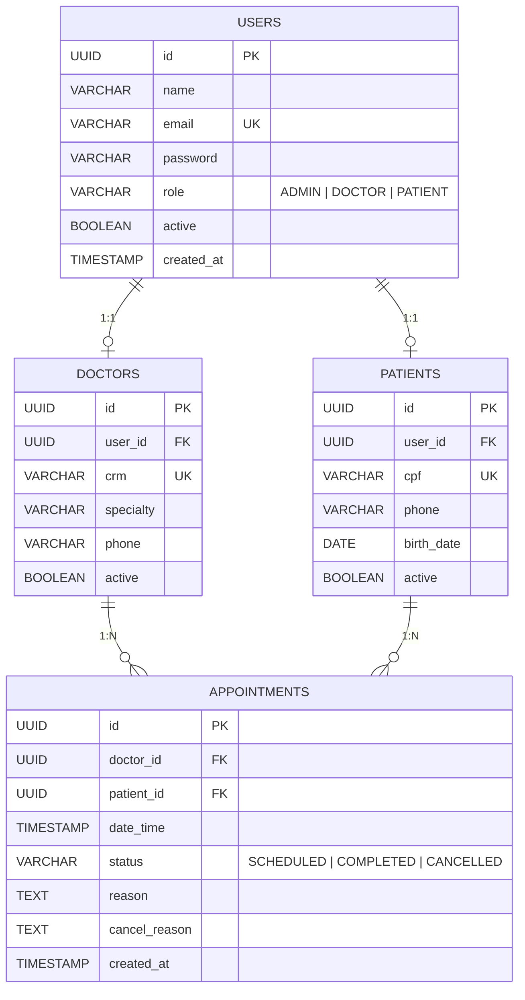
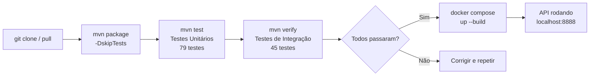

# Medical Scheduling API


API REST para gerenciamento de agendamentos médicos em clínicas. Implementa autenticação JWT (Access + Refresh Token), regras de negócio com validação robusta, 124 testes automatizados e stack completamente containerizável via Docker.

---

## Índice

- [Medical Scheduling API](#medical-scheduling-api)
  - [Índice](#índice)
  - [Sobre o Projeto](#sobre-o-projeto)
    - [Atores do Sistema](#atores-do-sistema)
  - [Tecnologias](#tecnologias)
  - [Arquitetura](#arquitetura)
    - [Diagrama de Pacotes](#diagrama-de-pacotes)
    - [Estrutura de Pastas](#estrutura-de-pastas)
    - [Fluxo de Agendamento](#fluxo-de-agendamento)
    - [Fluxo de Autenticação](#fluxo-de-autenticação)
  - [Banco de Dados](#banco-de-dados)
    - [Índices](#índices)
  - [Regras de Negócio](#regras-de-negócio)
    - [Agendamento](#agendamento)
    - [Cancelamento](#cancelamento)
    - [Conclusão](#conclusão)
    - [Soft Delete (Inativação)](#soft-delete-inativação)
  - [Endpoints](#endpoints)
    - [Autenticação](#autenticação)
    - [Médicos](#médicos)
    - [Pacientes](#pacientes)
    - [Consultas](#consultas)
    - [Códigos de Resposta](#códigos-de-resposta)
  - [Como Executar](#como-executar)
    - [Pré-requisitos](#pré-requisitos)
    - [Opção 1 — Docker Compose (recomendado)](#opção-1--docker-compose-recomendado)
    - [Opção 2 — Execução Local (banco no Docker)](#opção-2--execução-local-banco-no-docker)
    - [Credenciais padrão](#credenciais-padrão)
  - [Testes](#testes)
  - [Qualidade](#qualidade)
  - [Fluxo de Build](#fluxo-de-build)
  - [Decisões Técnicas](#decisões-técnicas)
  - [Glossário](#glossário)
  - [Contribuindo](#contribuindo)
  - [Autor](#autor)
  - [Licença](#licença)

---

## Sobre o Projeto

A Medical Scheduling API é um sistema backend para clínicas médicas gerenciarem médicos, pacientes e consultas. O sistema implementa regras de negócio reais, segurança com JWT, documentação interativa via Swagger e testes unitários e de integração com banco de dados real via Testcontainers.

### Atores do Sistema

| Ator | Role | Permissões |
|---|---|---|
| Administrador | `ADMIN` | Cadastra/inativa médicos e pacientes; lista e gerencia todas as consultas |
| Médico | `DOCTOR` | Visualiza sua agenda, detalhes de consultas próprias e as conclui |
| Paciente | `PATIENT` | Agenda, cancela e visualiza suas próprias consultas |

---

## Tecnologias

| Categoria | Tecnologia | Versão |
|---|---|---|
| Linguagem | Java | 21 |
| Framework | Spring Boot | 3.3.5 |
| Segurança | Spring Security 6 + JJWT | 0.12.6 |
| Persistência | Spring Data JPA + Hibernate | managed |
| Banco de dados | PostgreSQL | 16 |
| Migrations | Flyway | managed |
| Documentação | SpringDoc OpenAPI (Swagger UI) | 2.6.0 |
| Testes unitários | JUnit 5 + Mockito | managed |
| Testes de integração | Testcontainers | 1.21.4 |
| Build | Maven | 3.9 |
| Containerização | Docker + Docker Compose | — |
| Validação | Jakarta Bean Validation | managed |

---

## Arquitetura

### Diagrama de Pacotes



### Estrutura de Pastas

```
src/
├── main/
│   ├── java/com/medicalscheduling/
│   │   ├── config/          # SecurityConfig, JwtConfig, OpenApiConfig
│   │   ├── controller/      # Endpoints REST
│   │   ├── domain/          # Entidades JPA + enums (User, Doctor, Patient, Appointment)
│   │   ├── dto/
│   │   │   ├── request/     # Records de entrada (CreateDoctorRequest, ...)
│   │   │   └── response/    # Records de saída (DoctorResponse, TokenResponse, ...)
│   │   ├── exception/       # GlobalExceptionHandler + exceções customizadas
│   │   ├── repository/      # Interfaces Spring Data JPA
│   │   ├── service/         # Lógica de negócio
│   │   └── validator/       # AppointmentValidator — regras de agendamento
│   └── resources/
│       ├── application.yml
│       └── db/migration/    # V1…V6 — schema versionado com Flyway
└── test/
    ├── java/com/medicalscheduling/
    │   ├── controller/      # Testes de integração (*IT.java) com Testcontainers
    │   ├── service/         # Testes unitários com Mockito
    │   └── validator/       # Testes unitários do AppointmentValidator
    └── resources/
        └── application-test.yml
```

### Fluxo de Agendamento



### Fluxo de Autenticação



---

## Banco de Dados



### Índices

| Tabela | Índice | Tipo | Finalidade |
|---|---|---|---|
| `users` | `idx_users_email` | B-tree | Lookup por e-mail no login |
| `doctors` | `idx_doctors_specialty` | B-tree | Filtro por especialidade |
| `appointments` | `idx_appointments_doctor_datetime` | B-tree | Validação de conflito de horário do médico |
| `appointments` | `idx_appointments_patient_datetime` | B-tree | Validação de limite diário do paciente |
| `appointments` | `idx_appointments_status` | B-tree | Filtros por status |
| `appointments` | `uq_appointments_doctor_datetime_active` | Unique Partial | Previne double-booking (`WHERE status <> 'CANCELLED'`) |

---

## Regras de Negócio

### Agendamento

| # | Regra | Componente |
|---|---|---|
| RN-01 | Médico deve estar ativo | `AppointmentValidator` |
| RN-02 | Paciente deve estar ativo | `AppointmentValidator` |
| RN-03 | Horário comercial: segunda a sábado, 07:00–17:59 | `AppointmentValidator` |
| RN-04 | Antecedência mínima de 30 minutos | `AppointmentValidator` |
| RN-05 | Médico não pode ter dois agendamentos ativos no mesmo horário | `AppointmentValidator` + DB unique index |
| RN-06 | Paciente não pode ter dois agendamentos ativos no mesmo dia | `AppointmentValidator` |

### Cancelamento

| # | Regra | Componente |
|---|---|---|
| RN-07 | Antecedência mínima de 24 horas | `AppointmentValidator` |
| RN-08 | `cancel_reason` obrigatório | `CancelAppointmentRequest` |
| RN-09 | Consulta já concluída não pode ser cancelada | `AppointmentValidator` |
| RN-10 | Paciente só pode cancelar sua própria consulta | `AppointmentService` |
| RN-11 | Médico só pode cancelar suas próprias consultas | `AppointmentService` |

### Conclusão

| # | Regra | Componente |
|---|---|---|
| RN-12 | Apenas consultas `SCHEDULED` podem ser concluídas | `AppointmentValidator` |
| RN-13 | Apenas `ADMIN` ou o `DOCTOR` dono da consulta pode concluir | `AppointmentService` |

### Soft Delete (Inativação)

| # | Regra | Componente |
|---|---|---|
| RN-14 | Ao inativar médico, todas as consultas futuras `SCHEDULED` são canceladas automaticamente | `DoctorService` |
| RN-15 | Ao inativar paciente, todas as consultas futuras `SCHEDULED` são canceladas automaticamente | `PatientService` |

---

## Endpoints

> **Base URL (local):** `http://localhost:8888`
> **Documentação interativa:** `http://localhost:8888/swagger-ui.html`

### Autenticação

| Método | Endpoint | Acesso | Descrição |
|---|---|---|---|
| `POST` | `/api/auth/register` | Público | Cadastro de novo paciente |
| `POST` | `/api/auth/login` | Público | Login — retorna tokens JWT |
| `POST` | `/api/auth/refresh` | Público | Renovar access token |

<details>
<summary><strong>Exemplos curl</strong></summary>

```bash
# Registro de paciente
curl -s -X POST http://localhost:8888/api/auth/register \
  -H "Content-Type: application/json" \
  -d '{"name":"Maria Silva","email":"maria@example.com","password":"senha123"}'

# Login (salve o accessToken retornado)
curl -s -X POST http://localhost:8888/api/auth/login \
  -H "Content-Type: application/json" \
  -d '{"email":"admin@medical.com","password":"admin123"}'

# Renovar token
curl -s -X POST http://localhost:8888/api/auth/refresh \
  -H "Content-Type: application/json" \
  -d '{"refreshToken":"<refresh_token>"}'
```
</details>

### Médicos

| Método | Endpoint | Permissão | Descrição |
|---|---|---|---|
| `POST` | `/api/doctors` | `ADMIN` | Cadastrar médico |
| `GET` | `/api/doctors` | Autenticado | Listar médicos ativos (filtro: `?specialty=`) |
| `GET` | `/api/doctors/{id}` | `ADMIN` ou `DOCTOR` | Detalhar médico |
| `GET` | `/api/doctors/{id}/agenda` | `ADMIN` ou `DOCTOR` | Agenda paginada do médico |
| `PUT` | `/api/doctors/{id}` | `ADMIN` | Atualizar médico |
| `DELETE` | `/api/doctors/{id}` | `ADMIN` | Inativar médico (soft delete) |

Especialidades disponíveis: `CARDIOLOGY`, `DERMATOLOGY`, `ORTHOPEDICS`, `NEUROLOGY`, `PEDIATRICS`, `GENERAL_PRACTICE`

<details>
<summary><strong>Exemplos curl</strong></summary>

```bash
TOKEN="<access_token>"

# Cadastrar médico
curl -s -X POST http://localhost:8888/api/doctors \
  -H "Authorization: Bearer $TOKEN" \
  -H "Content-Type: application/json" \
  -d '{
    "name": "Dr. João Costa",
    "email": "joao.costa@clinic.com",
    "password": "senha123",
    "crm": "CRM-SP-123456",
    "specialty": "CARDIOLOGY",
    "phone": "(11) 99999-0001"
  }'

# Listar médicos filtrando por especialidade
curl -s "http://localhost:8888/api/doctors?specialty=CARDIOLOGY" \
  -H "Authorization: Bearer $TOKEN"

# Agenda paginada de um médico
curl -s "http://localhost:8888/api/doctors/<doctor_id>/agenda?page=0&size=10" \
  -H "Authorization: Bearer $TOKEN"
```
</details>

### Pacientes

| Método | Endpoint | Permissão | Descrição |
|---|---|---|---|
| `POST` | `/api/patients` | `ADMIN` | Cadastrar paciente |
| `GET` | `/api/patients` | `ADMIN` | Listar pacientes ativos (paginado) |
| `GET` | `/api/patients/{id}` | `ADMIN` ou `PATIENT` | Detalhar paciente |
| `PUT` | `/api/patients/{id}` | `ADMIN` ou `PATIENT` | Atualizar paciente |
| `DELETE` | `/api/patients/{id}` | `ADMIN` | Inativar paciente (soft delete) |

<details>
<summary><strong>Exemplos curl</strong></summary>

```bash
TOKEN="<access_token>"

# Cadastrar paciente
curl -s -X POST http://localhost:8888/api/patients \
  -H "Authorization: Bearer $TOKEN" \
  -H "Content-Type: application/json" \
  -d '{
    "name": "Ana Paula",
    "email": "ana@example.com",
    "password": "senha123",
    "cpf": "123.456.789-09",
    "phone": "(11) 98765-4321",
    "birthDate": "1990-05-15"
  }'

# Listar pacientes (paginado)
curl -s "http://localhost:8888/api/patients?page=0&size=10" \
  -H "Authorization: Bearer $TOKEN"
```
</details>

### Consultas

| Método | Endpoint | Permissão | Descrição |
|---|---|---|---|
| `POST` | `/api/appointments` | `PATIENT` | Agendar consulta |
| `GET` | `/api/appointments` | `ADMIN` | Listar todas as consultas (paginado) |
| `GET` | `/api/appointments/my` | `PATIENT` | Minhas consultas (paginado) |
| `GET` | `/api/appointments/{id}` | Autenticado | Detalhar consulta |
| `PATCH` | `/api/appointments/{id}/cancel` | `PATIENT` ou `ADMIN` | Cancelar consulta |
| `PATCH` | `/api/appointments/{id}/complete` | `ADMIN` ou `DOCTOR` | Concluir consulta |

<details>
<summary><strong>Exemplos curl</strong></summary>

```bash
TOKEN="<access_token>"

# Agendar consulta (seg–sáb, 07:00–17:59, com ≥30 min de antecedência)
curl -s -X POST http://localhost:8888/api/appointments \
  -H "Authorization: Bearer $TOKEN" \
  -H "Content-Type: application/json" \
  -d '{
    "doctorId": "<doctor_id>",
    "dateTime": "2026-05-10T09:00:00",
    "reason": "Consulta de rotina — dor no peito"
  }'

# Cancelar consulta (≥24h de antecedência)
curl -s -X PATCH "http://localhost:8888/api/appointments/<id>/cancel" \
  -H "Authorization: Bearer $TOKEN" \
  -H "Content-Type: application/json" \
  -d '{"cancelReason": "Compromisso inadiável"}'

# Concluir consulta
curl -s -X PATCH "http://localhost:8888/api/appointments/<id>/complete" \
  -H "Authorization: Bearer $TOKEN"
```
</details>

### Códigos de Resposta

| Código | Significado |
|---|---|
| `200 OK` | Operação bem-sucedida |
| `201 Created` | Recurso criado com sucesso |
| `400 Bad Request` | Dados de entrada inválidos (Bean Validation) |
| `401 Unauthorized` | Token ausente, expirado ou inválido |
| `403 Forbidden` | Sem permissão para o recurso |
| `404 Not Found` | Recurso não encontrado |
| `422 Unprocessable Entity` | Violação de regra de negócio |
| `500 Internal Server Error` | Erro inesperado no servidor |

---

## Como Executar

### Pré-requisitos

- Docker ≥ 20.10 e Docker Compose v2
- Java 21 e Maven 3.9 (apenas para execução local)

### Opção 1 — Docker Compose (recomendado)

Sobe a API e o PostgreSQL em containers isolados:

```bash
# 1. Clone o repositório
git clone https://github.com/Alysson-Araujo/agendamento-medico-api.git
cd agendamento-medico-api

# 2. Sobe todos os serviços (build incluído)
docker compose up --build -d

# 3. Acompanhe os logs da API
docker compose logs -f api

# 4. Acesse
# API:        http://localhost:8888
# Swagger UI: http://localhost:8888/swagger-ui.html

# 5. Parar
docker compose down
```

### Opção 2 — Execução Local (banco no Docker)

Útil durante o desenvolvimento:

```bash
# 1. Sobe apenas o PostgreSQL
docker compose up -d postgres

# 2. Aguarde o health check ficar healthy
docker compose ps postgres   # STATUS deve mostrar: healthy

# 3. Sobe a aplicação Spring Boot
mvn spring-boot:run

# API disponível em http://localhost:8888
```

### Credenciais padrão

| Campo | Valor |
|---|---|
| **URL** | `http://localhost:8888` |
| **Swagger UI** | `http://localhost:8888/swagger-ui.html` |
| **Admin e-mail** | `admin@medical.com` |
| **Admin senha** | `admin123` |

> **Dica:** Após o login, copie o `accessToken` e clique em **Authorize** no Swagger UI para autenticar todas as chamadas interativas.

---

## Testes

O projeto possui 124 testes divididos em duas categorias:

| Categoria | Plugin Maven | Arquivos | Total |
|---|---|---|---|
| Unitários | Surefire | `AppointmentValidatorTest`, `AppointmentServiceTest`, `AuthServiceTest`, `DoctorServiceTest`, `PatientServiceTest`, `TokenServiceTest` | 79 |
| Integração | Failsafe | `AuthControllerIT`, `DoctorControllerIT`, `PatientControllerIT`, `AppointmentControllerIT` | 45 |

Os testes de integração usam Testcontainers, um PostgreSQL real é iniciado em container durante a execução, sem mocks de banco.

```bash
# Apenas testes unitários
mvn test

# Todos os testes (unitários + integração) - requer Docker
mvn verify

# Suite específica (unitário)
mvn test -Dtest=AppointmentServiceTest

# Suite específica (integração)
mvn verify -Dit.test=DoctorControllerIT
```

---

## Qualidade

| Métrica | Valor |
|---|---|
| Testes unitários | 79 |
| Testes de integração | 45 |
| Total de testes | **124** |
| Taxa de aprovação | **100%** |
| Camadas cobertas | Controller (IT), Service, Validator |
| Banco de dados nos testes de integração | PostgreSQL 16 real (Testcontainers 1.21.4) |

---

## Fluxo de Build



---

## Decisões Técnicas

| Decisão | Motivo |
|---|---|
| UUID como PK | Evita exposição de IDs sequenciais; mais seguro em APIs públicas |
| Soft delete (`active`) | Preserva histórico — consultas antigas não ficam órfãs |
| `cancel_reason` nullable | Só preenchido quando `status = CANCELLED` |
| `role` na tabela `users` | Simplifica autenticação sem tabela extra de roles |
| `crm` e `cpf` UNIQUE no banco | Integridade garantida na camada de dados |
| Índices em FKs de `appointments` | Performance nas validações de conflito de horário |
| Pessimistic lock em `findByIdForUpdate` | Serializa criações concorrentes para o mesmo médico — previne race condition |
| Partial unique index em `appointments` | Belt-and-suspenders contra double-booking; exclui slots `CANCELLED` para reutilização |
| JWT Access (2h) + Refresh (7d) | Segurança sem estado no servidor com renovação transparente |
| Testcontainers | Testes de integração contra PostgreSQL real, sem mocks de banco |
| Flyway migrations | Controle versionado e reproduzível do schema |
| `@ControllerAdvice` global | Tratamento uniforme de erros em toda a API |
| Records Java para DTOs | Imutabilidade, `equals`/`hashCode`/`toString` automáticos, sem boilerplate |

---

## Glossário

| Termo | Definição |
|---|---|
| **Soft delete** | Marcar registro como inativo (`active = false`) em vez de removê-lo fisicamente; preserva histórico |
| **Access Token** | JWT de curta duração (2h) enviado no header `Authorization: Bearer <token>` em cada requisição |
| **Refresh Token** | JWT de longa duração (7d) usado exclusivamente para gerar novos access tokens |
| **Pessimistic lock** | Bloqueia a linha no banco (`SELECT ... FOR UPDATE`) para serializar operações concorrentes na mesma linha |
| **Partial unique index** | Índice único com cláusula `WHERE`; aplica a restrição apenas a um subconjunto das linhas |
| **Double-booking** | Dois agendamentos para o mesmo médico no mesmo horário; prevenido por lock + unique index |
| **Race condition** | Situação em que dois processos simultâneos produzem resultado incorreto; mitigada pelo pessimistic lock |
| **Testcontainers** | Biblioteca Java que sobe containers Docker temporários durante os testes e os destrói ao final |
| **Flyway migration** | Script SQL versionado (`V1__...sql`) que evolui o schema do banco de forma controlada e reproduzível |
| **Specialty** | Especialidade médica; valores aceitos: `CARDIOLOGY`, `DERMATOLOGY`, `ORTHOPEDICS`, `NEUROLOGY`, `PEDIATRICS`, `GENERAL_PRACTICE` |

---

## Contribuindo

1. Faça um fork do repositório
2. Crie uma branch descritiva:
   ```bash
   git checkout -b feature/nome-da-feature
   # ou
   git checkout -b fix/descricao-do-bug
   ```
3. Implemente suas mudanças com testes
4. Certifique-se que todos os testes passam:
   ```bash
   mvn verify
   ```
5. Abra um Pull Request usando o template abaixo:

```markdown
## Descrição
Explique o que foi feito e por quê.

## Tipo de mudança
- [ ] Bug fix
- [ ] Nova feature
- [ ] Refactoring
- [ ] Documentação

## Testes
- [ ] Testes unitários adicionados/atualizados
- [ ] Testes de integração adicionados/atualizados
- [ ] `mvn verify` passando localmente

## Checklist
- [ ] Código segue o estilo do projeto
- [ ] Sem credenciais ou secrets no código
- [ ] Migrations Flyway criadas (se houver mudanças no schema)
```

---

## Autor

Desenvolvido por **Alysson Araújo**

---

## Licença

Este projeto está sob a licença MIT.
